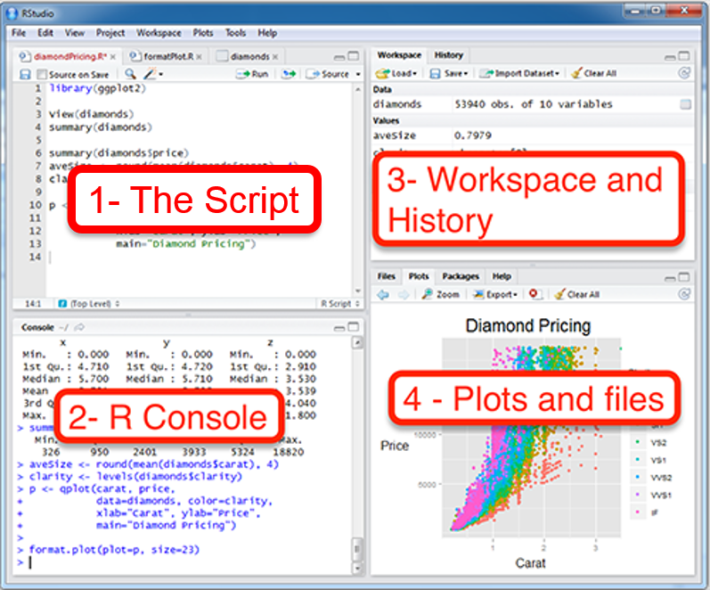
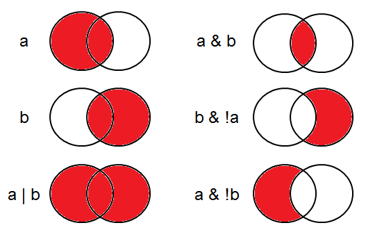
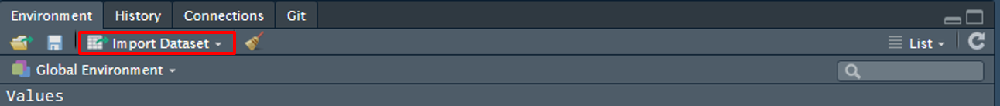
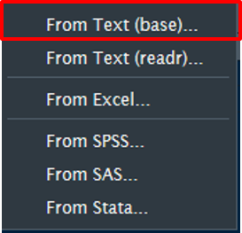
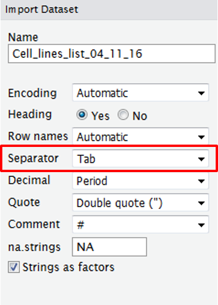

# Introduction
Cancer immunotherapy research is quite diverse, ranging from *in vitro* methods to *in silico* analysis of large clinical datasets. Clinical datasets usually include response and survival with a number of parameters that are measured from the patient eg. blood values. To be able to explore the data, we will use [R](https://www.r-project.org/) to perform some simple statistical tests to look predicitive and prognostic markers. 

# What is R
- Free statistical language
- Works on Mac, Windows and Linux
- Detailed and complete help available
- [Rstudio](https://www.rstudio.com/) is a nice IDE to work in R

# What can R do
- Tables
- Explore data
- Arrange / merge tables according to multiple criteria
- Statistics
    - T-test, Chi-squared, ANOVA, Regression, Multiple regression, General linear model         (logistic regression), Mixed effects models, Multivariate methods etc.
- Graphs
    - Creates graphical outputs of publication quality.
- Save as pdf, eps, jpeg, png, bitmap, tiff


# Installation
To install R download it from [https://www.r-project.org/](https://www.r-project.org/)  
To install Rstudio download it from [https://www.rstudio.com/](https://www.rstudio.com/)


# Getting started with R studio

## Layout
This is what RStudio looks like  

  
    1. To write your script (will stay visible), record what you did and why (comments)  
    2. Where R runs the commands one after the other (will not be saved)  
    3. Where you can see what’s stored in the memory  

## Start your script

### Name your script 
Start your script by giving it a name and briefly commenting on what you intend to do.  
The **#** allows you to comment your script, R will not consider what is written on the line after the **#**.  
```{r, message = TRUE, warning = FALSE, echo = TRUE, eval = FALSE}
##############################
# This is my first R script #
#############################

# Introduction to R
# ....
```

### Clear memory  
In order to make sure no variables are already assigned it is important to clear R's brain before starting a new project.  
```{r, message = TRUE, warning = FALSE, echo = TRUE, eval = FALSE}

rm(list = ls())    # this command clears R memory

```

### Install packages / Load libraries  
R comes with some default packages for statistics and plotting but we will use fancier libraries for our analysis.
We will use the `install.packages()` function to add new libraries to our R installation.

The concept of installing packages and loading libraries for R are like apps on a smartphone.  
- To be able to use a new app on your phone, you first need to download it, in R you install the package. Once it has been installed in your session it will stay there, you do not have to install it again the next time you use R.  

- To then use this app you need to open it, in R you load the library. You need to load the libraries you will need everytime you start a new script.  

```{r, message = TRUE, warning = FALSE, echo = TRUE, eval = FALSE}
# Installing all the packages we will need 
install.packages("tidyverse")
install.packages("reshape2")
install.packages("ggplot2")

# you can also load them all together like this
install.packages(c("tidyverse", "reshape2", "ggplot2"))   
```
```{r, eval = TRUE, echo = TRUE}
# Loading the libraries we will use today

library(tidyverse) # note that here there is no " "
library(reshape2)

```


# R Syntax  
## R objects
R has five different classes of objects:  

Class     |Exemple            | Create a vector           |
----------|------------       |---------------------------| 
character |a, bc, def         |a <- c("a", "bc", "def")   |
numeric   |1.7, -1.7, 12, -12 |b <- c(1.7, -1.7, 12, -12) |
integer   |1, -1, 33, -33     |c <- c(1, -1, 33, -33)     |
logical   |TRUE, FALSE        |d <- c(TRUE, TRUE, FALSE)  |
factor    |green, blue, red   |e <- factor(c("green", "blue", "red", "red"))   |

The most basic object is a vector.
A vector can only contain objects from the same class. 
There is one exception which is the *list*. It can contain objects of different classes.

## Assigning variables  
Choose a variable and use the assignment character `<-` to assign it a value. Here we will assign the number 2 to the variable x.  
To visualise the variable, just type the name of the variable and press "Ctrl"+"Enter" (in the script) or just "Enter" (in the console).  
```{r, message = TRUE, warning = FALSE, echo = TRUE, eval = TRUE}
x <- 2  # assign "2" to the variable "x"
x
```
The output shows you how many results there are (here [1]) and will give you value of the result(s).

You can now assign another number to a second variable and make the sum of both.    
```{r, message = TRUE, warning = FALSE, echo = TRUE, eval = TRUE}
y <- 3  # assign "3" to the variable "y"

x+y
```

The result of a calculation can also be stored as a new variable
```{r, message = TRUE, warning = FALSE, echo = TRUE, eval = TRUE}
z <- x+y+x*y
z
```

The variable can also be a vector (sequence).  

```{r, message = TRUE, warning = FALSE, echo = TRUE, eval = TRUE}
my.vector1 <- c(1,2,3,4,5)

#this is another way of creating the same vector using the seq() function
my.vector2 <- seq(from=1, to=5, by=1)  

?seq  # run this command to get more information on the function and see how it is used

```


## Operators  

| Symbol | Meaning              | 
| -------|----------------------| 
| <  | Less than                |  
| <= | Less than or equal to    |  
| >  | Greater than             |  
| >= | Greater than or equal to |  
| == | Equal to                 |  
| != | Not equal to             |  
| !a | Not a                    |  
|a\|b| a or b                   |  
|a&b | a and b                  |  
  
</br>
Examples of grouping:
{ height=60% width=60% }  


#Importing and exploring datasets  

## Easy way to import dataset
Use the "Import Dataset" button in the "Workspace and history" panel  
  
select "From Text (base)..."  
{ height=30% width=30% }  
Make sure the Data Frame (bottom right box) shows well separated columns  
If it is not the case you will have to change the settings, such as which separator to use, does your table have headings, what notation is used to mark the missing values (standard would be NA but your table may contain "?" or any other string)  
{ height=40% width=40% }    

The correct command to import your dataset will then appear in the "Console".  
You can copy it and paste it in your "Script".  

Once you get more used to the R language you can also directly type the comand to import your dataset from your script.  
Note: once you start typing the path to the folder (i.e. "/data/Sabrina/..."), after the "/" you can press the tab key to visualise files and folders in this directory.  

## Import table with code
We have two tables with some clinical data, one with the clinical characteristics like stage, sex and age of the patient, and the other the treatment information. Both are tab-delimited tables, so we will use the `read.table()` function to import it. We have to tell R how the table is delimited, in this case its by tab so we set `sep = "\t"`. We also know the first line of the table are the names of the column so we set `header = TRUE`. This will import the table into R as a `data.frame`. This is a specific object in R that holds data in a rectangular format, where the data is organized by rows and columns.

```{r, message = TRUE, warning = FALSE, echo = TRUE, eval = TRUE}
patients <- read.table("data/Derm_patients.txt", sep = "\t", header = TRUE)
treatment <- read.table("data/Derm_treatments.txt", sep = "\t", header = TRUE)
```

## Inspecting your dataset
It is very important to make sure your data has been correctly imported.  
However, sometimes the table can be huge. 
Here are a few commands that can help you assess the shape of your dataset:  
```{r, message = TRUE, warning = FALSE, echo = TRUE, eval = FALSE}
#number of rows in the table
nrow(patients)
nrow(treatment)

#number of columns in the table
ncol(patients)
ncol(treatment)

#structure of the table
str(patients)
str(treatment)

#get the first 6 rows of the table
head(patients)
head(treatment)
#get the last 6 rows of the table
tail(patient)
tail(treatment)
```

You notice that the patient and treatment table are different sizes, that's because not all patients receive systemic treatment. Many of the patients we see in the clinic are early stage melanomas which are removed with surgery. So what we will do next is extract the metastatic patients from the patient table and use these to find the first systemic they received from the treatment table.

# Looking into the data frame
Now that we have the table as a `data.frame` we can access all the data by rows and columns. We can use square brackets `[]` to look inside the patients `data.frame`. 

```{r, message = TRUE, warning = FALSE, echo = TRUE, eval = FALSE}
#to look at the first row of the data frame
patients[1,]

patients %>%
  slice(1)

#to look at the first column of the data frame
patients[, 1]

patients %>%
  select(1)

#to get the data from the second row third column of the data frame
patients[2,3]

patients %>%
  slice(2) %>%
  select(3)

#a nice convenience with the data frame is we can use the column names to subset instead of a number
#we can use the colnames() function to get the column names of the data frame
colnames(patients)

patients[, "PAT_ID"]

patients %>%
  select(PAT_ID)


patients[, c("PAT_ID", "HUICC")]

patients %>%
  select(PAT_ID, HUICC)

#we can also access the column using "$"
patients$PAT_ID

#we could techincally do the same with rows, but by default read.table just names the rows in numeric ascending order. You would need to assign the names for the rows first.
head(rownames(patients))
```

# Subsetting and summarizing
Regular R syntax is quite cumbersome and Hadley Wickman developed the `tidyverse` suite of libraries to make it easier to manipulate data in R. We will use this special function called the pipe `%>%` later. This allows the code to flow from left to right so it is more readable. We will show you an example of how we subset the table with regular R and then using `dplyr`. The staging information is located in the **HUICC** column and the **PAT_ID** column is how we will match the patients from the clinical table to the treatment table. We will extract all *Stage IV* patients, then find out what systemic treatment they received first.

```{r, message = TRUE, warning = FALSE, echo = TRUE, eval = false}
#first we will check what stages are in the HUICC column
#we can summarize the HUICC with table

table(patients$HUICC)

#we can see all the different types of stages in the HUICC column and we will choose IV
patients$HUICC == "IV"

#this will return a TRUE/FALSE vector which we can use to subset the patient table
ptiv <- patients[patients$HUICC == "IV",]

patients %>%
  filter(HUICC == "IV")


#we can now get the mean age of stage IV patients with the DIAALTER
mean(patients[patients$HUICC == "IV", "DIAALTER"])

patients %>%
  filter(HUICC == "IV") %>%
  summarise(mean.age = mean(DIAALTER))
  
#how about getting the mean age for all stages from the HUICC column?
#we can use aggregate
aggregate(DIAALTER ~ HUICC, data = patients, mean, na.rm = TRUE)

patients %>%
  group_by(HUICC) %>%
  summarise(mean.age = mean(DIAALTER))
```

Quite often for clinical papers, we will need a table to summarize all the clinical characteristics of the patient cohort. It is quite tedious to go through each column to count how many exist in each group. So we will use a library called `tableone` to help us

```{r, message = TRUE, warning = FALSE, echo = TRUE, eval = false}
library(tableone)

#we don't need to summarize all the columns in the table so we will include the ones we are interested in
CreateTableOne(vars = c("SEX", "DIAICD10", "HIST", "HUICC", "DIAALTER"), data = patients)

#we can see the HIST column was evaluated as an actual number and not a categorical variable
CreateTableOne(vars = c("SEX", "DIAICD10", "HIST", "HUICC"), data = patients, factorVars = "HIST")

#we can also stratify this table with a specific column, so for instance Sex
CreateTableOne(vars = c("SEX", "DIAICD10",  "HUICC"), data = patients, factorVars = "HIST", strata = "SEX")

```

# Some clinical learning
The DIAICD10 column is the International Classification of Diseases coding [ICD10](http://www.who.int/classifications/icd/en/) from the WHO
In our table we are only interested in the melanomas which are class C43
The HIST column is the International Classification of Diseases for Oncology coding [ICD-O-3](http://codes.iarc.fr/) The 87xx series will identify the subtype of melanoma

#Some exercises
We would like to create a summary table for all melanomas (C43) sorted by subtype: Superficial spreading, nodular, lentigo maligna, and malignant melanoma NOS (not otherwise specified). We want to know the average age, male and female distribution, and average breslow depth if available. **hint** you can use `grepl()` capture all C43.X patients

```{r, message = TRUE, warning = FALSE, echo = TRUE, eval = false}
pm <- patients[grepl("C43", patients$DIAICD10) & (patients$HIST == 87203 | patients$HIST == 87213 | patients$HIST == 87433 | patients$HIST == 87423 | patients$HIST == 87413), c("DIAALTER", "SEX", "HIST")]

pmtable <- CreateTableOne(c("DIAALTER", "SEX"), data = pm, factorVars = "HIST", strata = "HIST")
```

#Merging tables

We can also now use Stage IV melanoma patients and find out what systemic treatment they received first.
The function `merge()` will allow us to combine two tables based on a single common column. In our case, we will use the **PAT_ID** column. First we will remove all the duplicates from the treatment table by filtering with the function `duplicated`. 

```{r}
#duplicated will return a TRUE/FALSE vector. It will mark the first instance of a variable with FALSE and afterwards any repeat will be marked with TRUE
#This shows how many duplicates there are in the treatment table
table(duplicated(treatment$PAT_ID))

treatment %>%
  filter(duplicated(PAT_ID)) %>%
  summarise(nb.duplicated=n())

#since we don't know how the dates of the treatment are sorted we will sort from earliest to latest
#we will convert the BEGINN column with as.Date() to a Date class for sorting

treatment$Date_start <- as.Date(treatment$BEGINN, "%d.%m.%Y")
class(treatment$BEGINN)
class(treatment$Date_start)

#using order() we can create an index vector to order the rows from earliest date to latest date
treatment.order <- treatment[order(treatment$Date_start),]

#we can see there is still the same amount of duplicates in our new sorted table
table(duplicated(treatment.order$PAT_ID))

#now we will remove all the duplicates
treatment2 <- treatment.order[!duplicated(treatment.order$PAT_ID),]
table(duplicated(treatment2$PAT_ID))

treatment3 <- treatment %>%
  mutate(Date_start=dmy(treatment$BEGINN))%>%
  arrange(Date_start) %>%
  filter(!duplicated(PAT_ID))

#now that our treatment table just has one treatment per patient, we can merge it to the patient table
pt <- merge(patients, treatment2, by = "PAT_ID", all.x = TRUE)

pt4 <- pt[pt$HUICC == "IV", ]

pt1 <- treatment2 %>%
  left_join(patients, treatment2, by="PAT_ID") %>%
  filter(HUICC == "IV")

#we can see the number of treatments in the PRO_BEZ column
table(pt4$PRO_BEZ)
```

#Exercise
Create a summary table with the Stage IV melanoma patients for Sex, Age, and Treatment

# Cheat sheets

- dplyr [(download pdf)](https://www.rstudio.com/wp-content/uploads/2015/02/data-wrangling-cheatsheet.pdf)
- ggplot2 [(download pdf)](https://www.rstudio.com/wp-content/uploads/2015/03/ggplot2-cheatsheet.pdf)


