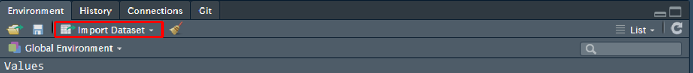
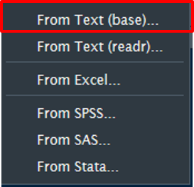
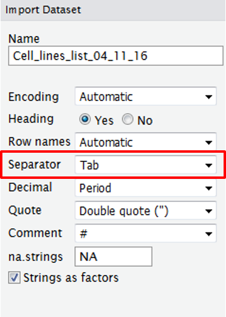
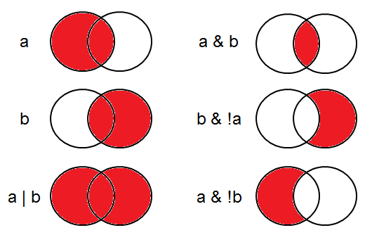

# Introduction
Cancer immunotherapy research is quite diverse and large datasets of clinical parameters such as hematological values, response and survival are being collected by the hospital. We can explore the data using [R](https://www.r-project.org/) and perform some simple statistical tests to look predicitive and prognostic markers. 

# What is R
- Free statistical language
- Works on Mac, Windows and Linux
- Detailed and complete help available
- [Rstudio](https://www.rstudio.com/) is a nice IDE to work in R

# What can R do
- Tables
- Explore data
- Arrange / merge tables according to multiple criteria
- Statistics
    - T-test, Chi-squared, ANOVA, Regression, Multiple regression, General linear model         (logistic regression), Mixed effects models, Multivariate methods etc.
- Graphs
    - Creates graphical outputs of publication quality.
- Save as pdf, eps, jpeg, png, bitmap, tiff


# Installation
To install R download it from [https://www.r-project.org/](https://www.r-project.org/)
To install Rstudio download it from [https://www.rstudio.com/](https://www.rstudio.com/)

# Installing packages
R comes with some default packages for statistics and plotting but we will use fancier libraries for our analysis
inside we will use the install.packages function
```{r, message = TRUE, warning = FALSE, echo = TRUE, eval = FALSE}
install.packages(c("tidyverse"))
```

# Getting started with R studio
  
    1. To write your script (will stay visible), record what you did and why (comments)  
    2. Where R runs the commands one after the other (will not be saved)  
    3. Where you can see what’s stored in the memory  


# Syntax  

## Assigning variables  
```{r, message = TRUE, warning = FALSE, echo = TRUE, eval = TRUE}
x <- 1  # assign "1" to the variable "x"
y <- 2  # assign "2" to the variable "y"
```
Now we want R to give us the sum of x+y  
```{r, message = TRUE, warning = FALSE, echo = TRUE, eval = TRUE}
x+y
```
The output shows you how many results there are (here [1]) and will give you the result (3)

##Importing datasets  
Use the "Import Dataset" button in the "Workspace and history" panel  
  
select "From Text (base)..."  
{ height=30% width=30% }  
Make sure the Data Frame (bottom right box) shows well separated columns  
If it is not the case you will have to change the settings, such as which separator to use, does your table have headings, what notation is used to mark the missing values (standard would be NA but your table may contain "?" or any other string)  
{ height=40% width=40% }    


# Operators  

| Symbol | Meaning                  | 
| -------|--------------------------| 
| **<**  | Less than                |  
| **<=** | Less than or equal to    |  
| **>**  | Greater than             |  
| **>=** | Greater than or equal to |  
| **==** | Equal to                 |  
| **!=** | Not equal to             |  
| **!a** | Not a                    |  
|**a\|b**| a or b                   |  
|**a&b** | a and b                  |  
  
</br>
Examples of grouping:
{ height=60% width=60% }  


# Cheat sheets

- dplyr [(download pdf)](https://www.rstudio.com/wp-content/uploads/2015/02/data-wrangling-cheatsheet.pdf)
- ggplot2 [(download pdf)](https://www.rstudio.com/wp-content/uploads/2015/03/ggplot2-cheatsheet.pdf)


