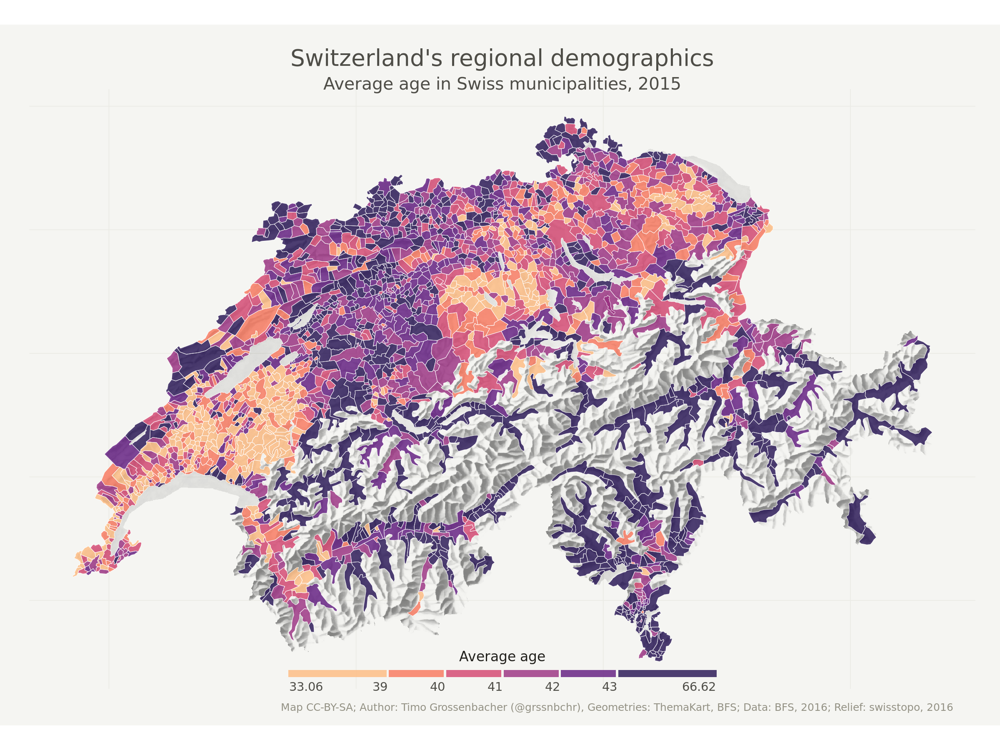
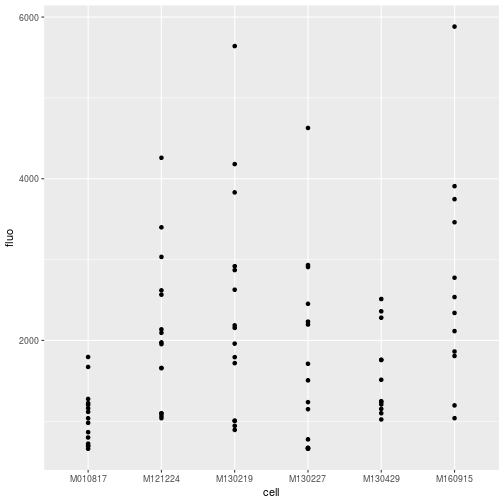
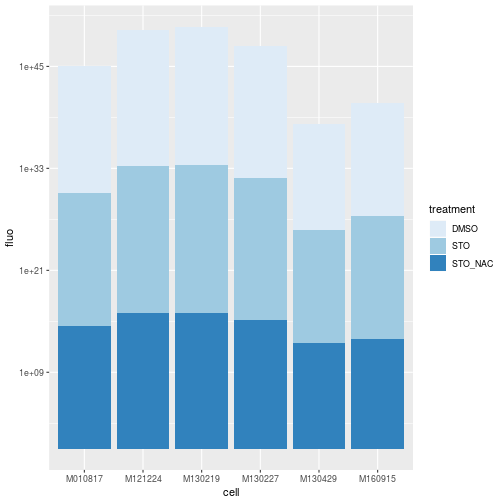
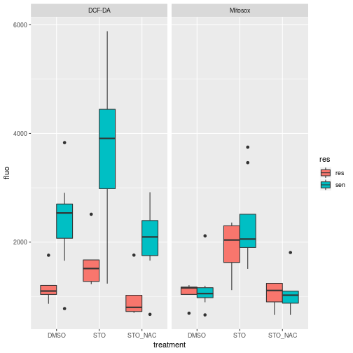

Plotting using the grammar of graphics (ggplot2)
========================================================
author: Patrick Turko
date: 26 September 2018
autosize: true

Why use ggplot2?
======================================================
incremental:true
- ggplot2 is an implementation of the "grammar of graphics"
- This allows the specification of graphs at a very high level of abstraction.
- Creation of very different graphs follows a consistent scheme.
- Sophisticated graphics can be created very quickly, allowing fluent investigation of data.
- With "themes", the appearance of graphs can be tweaked and perfected for publication.

- 


What is the Grammar of Graphics?
========================================================
incremental:true
The idea is to abstract all the features that make up a graph, and create a coherent system for specifying them. 

These features are specified as "layers", which together make up a finished graph. 

The grammar of graphics allows us to specify graphs using a consistent naming scheme for the layers. 

What is the Grammar of Graphics?
========================================================
incremental:true
type:subsection

A graph based on this system consists of the following parts:
- The data
- Aesthetic mapping
- A geometric object
- A coordinate system
- Etc (we'll get to the rest soon)

1. Data
========================================================
type: prompt
incremental:true

Needs to be in "long" format, meaning that each row represents an observation, each column represents a variable, and each cell represents the value thereof. 


```
     cell res treatment fluo
1 M130429 res      DMSO 1152
2 M010817 res      DMSO  691
3 M130429 res      DMSO 1208
4 M010817 res      DMSO 1160
5 M130429 res      DMSO 1099
6 M010817 res      DMSO 1036
```

1. Data
========================================================
type:prompt
incremental:true

Load data.csv in a new R session.

```r
data <- read.csv("data.csv", header= T, sep = ",")
```

1. Data
========================================================
type:prompt
incremental:true
- Several melanoma cell lines ("cell" column) were exposed to three drug treatments ("treatment").
- These cell lines were chosen on the basis of their resistance to treatment by a MEK inhibitor ("res"). 
- Two FACS analyses were performed ("test"): Mitosox measures the amount of superoxides in the mitochondria, while DCF-DA measures the superoxides in the cytosol. 
- The production of superoxides in those cellular compartments is indicated by fluorescence values ("fluo")

- We want to know if the new drug (STO) increases productions of superoxides, if this production differes between cellular compartment, and whether the change (if any) depends on whether the cells are resistant to the MEK inhibitor. Finally, to confirm that the fluorescence is really produced by the the drug, we check if the increase is reversed by the addition of an antioxidant (NAC)

2. Aesthetic mapping
========================================================
type:prompt
incremental:true

- An aesthetic is simply a visible aspect of a graph. 
- Examples include position (x, y), color, point size, line type, shape fill color, etc. 
- Aesthetics are *mapped* to variables using the aes() function
- Try this: 


```r
ggplot(data, aes(x = cell, y = fluo)) 
```

- What do you see?

2. Aesthetic mapping
========================================================
type:prompt
incremental:true


```r
ggplot(data, aes(x = cell, y = fluo)) 
```

- What do you see? 
- Aesthetic mapping creates a coordinate system based on some reasonable defaults. The coordinates will be different based on the data type and range. 

- But, to actually visualize the data, we need a *geometric object*. 

3. Geometric objects ("geoms")
========================================================
type:prompt
incremental:true

Geometric objects are the actual marks that we put on the graphs. They are described by the aesthetics that we map to them. 

Examples include: 
- Points, which take the aesthetics X and Y
- Lines, which require two X and Y coordinates
- Bars, which usually take a categorical X value and a numerical Y value

3. Geometric objects ("geoms")
========================================================
type:prompt
incremental:true
left:70

Geoms are added to plots using a "+" symbol. Like this:


```r
ggplot(data, aes(x = cell, y = fluo)) +
  geom_point()
```



***

Aesthetic mappings specified in the first ggplot command are *global*. Geoms will attempt to use these mappings unless overridden. 

3. Geometric objects ("geoms")
========================================================
type:prompt
incremental:true

- There are many geoms. Type geom_<tab> to see a list. 
- Each geom can accept a number of aesthetics, some of which are required. 
- To see the aesthetic possibilities and requirements for each geom, type ?geom_point
- Points, for example, can take the aesthetics x, y, alpha (transparency), color, fill (interior color), group, shape, size, and stroke. 
- Only X and Y are necessary to specify a point, which means that the other aesthetics can be mapped to other aspects of the data. 


Exercise 1
========================================================
type:section
incremental:true
Working with aesthetic mapping

- We now have the basic building blocks of a grammar:
- *Data* is mapped to *aesthetics*. These create a default *coordinate system*. 
- A *geometric object* is projected on to the coordinate system. The visual properties of this *geom* are determined by the *aesthetic mapping*. 

Using geom_point(), choose aesthetic mappings of the data to answer these questions:
-

- Do resistant or sensitive cells tend to have higher super oxide content ("fluo")?
- Which cell line, in which treatment, seems to have the least superoxides?
- Which treatment had overall highest superoxides? 
- Is the above true for both cellular compartments ("test")?


Exercise 1
========================================================
type:subsection
incremental:true
Working with aesthetic mapping

- Do resistant or sensitive cells tend to have higher super oxide content ("fluo")?

```r
ggplot(data, aes(x = cell,  y = fluo, color = res)) +
  geom_point()
```

- Which cell line, in which treatment, seems to have the least superoxides?

```r
ggplot(data, aes(x = cell, y = treatment, size = fluo)) +
  geom_point()
```

- Which treatment had overall highest superoxides? 

```r
ggplot(data, aes(x = treatment, y = fluo, color = res)) +
  geom_point()
```

- Is the above true for both cellular compartments ("test")?

```r
ggplot(data, aes(x = treatment, y = fluo, color = test)) +
  geom_point()
```

4. Statistics ("stats")
========================================================
incremental:true
type:prompt

- The plots we produced above could be made much more informative by summarizing the data somehow, instead of showing every point.
- This is accomplished using *stats*
- Stats are always applied, as each geom has a default stat. For geom_point, the default is "identity", ie, no transformation is applied. 
- To see the default stat for each geom, check ?geom_point
- Lets use a stat to summarize some of our data:


```r
ggplot(data, aes(x = cell, fill = test)) + 
  geom_bar() 
```

- What stat was applied here?

4. Statistics ("stats")
========================================================
incremental:true
type:prompt

- Stats are applied to the data before plotting. 
- Each stat produces new variables that are actually used to create the geoms. 
- These intermediate variables are available to you as well, in the format "..name..". You can see which are computed under ?geom_bar.

- Stats therefore rest between the first layer, *data*, and the next layer *aesthetics*. 
- Stats are always applied. But most geoms use the stat "identity", so that no transformation is actually applied. 


Exercise 2
========================================================
incremental:true
type:section
Working with stats

*Data* is transformed by a *statistic*. The resulting *values* are mapped to *aesthetics* in a *coordinate system*. Finally, *geometric objects* are projected, with aesthetic values taken from the data values. 

Create two graphs using geoms that apply a stat other than "identity".
---
Create a graph using a geom that applies a stat, but replace the stat with another.
---


Exercise 2
========================================================
incremental:true
type:subsection
Working with stats

Create two graphs using geoms that apply a stat other than "identity".

```r
ggplot(data, aes(x = fluo)) + 
  geom_density()

ggplot(data, aes(x = cell, y = fluo)) + 
  geom_bin2d()
```


```r
ggplot(data, aes(x = treatment, y = fluo)) +
  geom_bar(stat = "identity") 
```


A note on position adjustments
========================================================
type:alert
incremental:true
Data points often overlap. They can be separated 4 ways. 


```r
ggplot(data, aes(x = treatment, y = fluo, fill = cell)) +
  geom_bar(stat = "identity") 
```


```r
ggplot(data, aes(x = treatment, y = fluo, fill = cell)) +
  geom_bar(stat = "identity", position = "dodge") 
```

- The position arguments are: identity, dodge, fill, stack, and jitter. 
- To see the default position of a geom, type ?geom_bar

Try dodge, fill, and stack on the barplot above.
---

Try position adjustments to clarify this plot:
---


```r
ggplot(data, aes(x = treatment, y = fluo, fill = cell)) +
  geom_point() 
```

5. Scales
========================================================
incremental:true
type:prompt

- We've been saying that data values are "mapped" to aesthetic values. 
- This mapping is accomplished using *scales*. 


```r
ggplot(data, aes(x = fluo)) +
  geom_density()
```
- Here, "fluo" is mapped to X using the *scale 1:1*.


```r
ggplot(data, aes(x = treatment, y = cell, size = fluo, color = res)) +
  geom_point()
```
- Here, 
- treatment is mapped to X, and cell is mapped to Y, using *alphabetic scaling*
- fluo is mapped to point size, using the scale with *5 even bins, in steps of 1000*
- resistance is mapped to color, using a *default color pallette*

- All of these can be changed, exchanged, and personalized
---

- The scales for each aesthetic are available using the format "scale_aesthetic_type"


5. Scales
========================================================
incremental:true
type:prompt
Scales control the mapping between data values and aesthetics.


```r
ggplot(data, aes(x = treatment, y = cell, size = fluo, color = res)) +
  geom_point() 
```
This plot uses 4 default scales. 

Here's how to change the details of one of them:


```r
ggplot(data, aes(x = treatment, y = cell, size = fluo, color = res)) +
  geom_point() +
  scale_color_brewer(type = "qual", palette = 3)
```

Another example:

```r
ggplot(data, aes(x = fluo)) +
  geom_density() 
```


```r
ggplot(data, aes(x = fluo)) +
  geom_density() +
  scale_x_log10()
```

5. Scales
========================================================
incremental:true
type:prompt
Scales control the mapping between data values and aesthetics.

- Scale_aesthetic functions are how we control both *which* scale is applied, and the *deatils* of that scaling. 


```r
ggplot(data, aes(x = cell, y = treatment, color = fluo)) +
  geom_point(size = 10) + 
  scale_color_continuous(low = "red", high = "blue")
```

In grammatical terms, here's what we have now: 

*Data* is transformed by a *statistic*. The resulting *values* are mapped (using *scales*) to *aesthetics* in a *coordinate system*. Finally, *geometric objects* are projected, with aesthetic values taken from the data values. 

Exercise 3
========================================================
incremental:true
type:subsection
Working with scales


Produce this graph:

```r
ggplot(data, aes(x = cell, fill = treatment, y = fluo)) +
  geom_bar(stat = "identity") 
```

Using scale commands, make it look like this: 




6. Coordinates
========================================================
incremental:true
type:prompt

Coordinate manipulations change the graph *after* stats + mapping. 


```r
ggplot(data, aes(x = cell, fill = treatment, y = fluo)) +
  geom_bar(stat = "identity") 
```


```r
ggplot(data, aes(x = cell, fill = treatment, y = fluo)) +
  geom_bar(stat = "identity") +
  coord_cartesian(ylim = c(0, 10000))
```


```r
ggplot(data, aes(x = cell, fill = treatment, y = fluo)) +
  geom_bar(stat = "identity") +
  coord_flip()
```


7. Facets
========================================================
incremental:true
type:prompt
Facets split the data before plotting.

- We've been plotting the results of two different experiments at the same time (Mitosox and DCF-DA):


```r
ggplot(data, aes(x = cell, y = fluo, color = test)) +
  geom_point()
```

- It would be nice if we could separate them better. We can, with facets:


```r
ggplot(data, aes(x = cell, y = fluo)) +
  geom_point() +
  facet_grid(~ test)
```

- Notice the general form of a facet command: row varaible ~ column variable.


```r
ggplot(data, aes(x = cell, y = fluo)) +
  geom_point() +
  facet_grid( treatment ~ test)
```

7. Facets
========================================================
incremental:true
type:prompt
Facets split the data before plotting.

- We now have a complete grammar of graphics. 

- *Data* is transformed by a *statistic*. The resulting values are mapped (using *scales*) to *aesthetics* in a *coordinate system*. Finally, *geometric objects* are projected, with aesthetic values taken from the data values. All the above is *faceted* according to variables of interest. 
Exercise: create a plot that explicitly specifies each of the italic words above, as well as a position adjustment. 
---


```r
ggplot(data, aes(x = treatment, y = fluo, fill = cell)) +
  geom_bar(stat = "identity", position = "dodge") +
  scale_y_log10() + 
  scale_fill_brewer(palette = 2) +
  coord_flip() +
  facet_grid(~ test) 
```

Exercise 4
========================================================
incremental:true
type:subsection
Bringing it all together

Remember why we collected this data: We want to know if the new drug (STO) increases productions of superoxides, if this production differes between cellular compartment, and whether the change (if any) depends on whether the cells are resistant to the MEK inhibitor. Finally, to confirm that the fluorescence is really produced by the the drug, we check if the increase is reversed by the addition of an antioxidant (NAC). 

Create a single graph to answer the above questions 
---

Exercise 4
======================

```r
ggplot(data, aes(x = treatment, y = fluo, fill = res)) +
  geom_boxplot(position = "dodge") +
  facet_grid(~ test)
```




Summary: The complete grammar of graphics
===========
type:title
incremental:true

- *Data* is transformed by a *statistic*. 
- The resulting values are mapped (using *scales*) to *aesthetics* in a *coordinate system*.
- *Geometric objects* are projected, with aesthetic values taken from the data values. A
- All the above is *faceted* according to variables of interest.
- The appearance of the graphs is modified using *themes*.

- Using these simple parts, literally any graphics imagninable can be created. 
- By having a coherent vocabulary, we can quickly and effortlessley explore our data.

Other links
========================================================

http://r4ds.had.co.nz/data-visualisation.html
https://www.rstudio.com/wp-content/uploads/2015/03/ggplot2-cheatsheet.pdf
